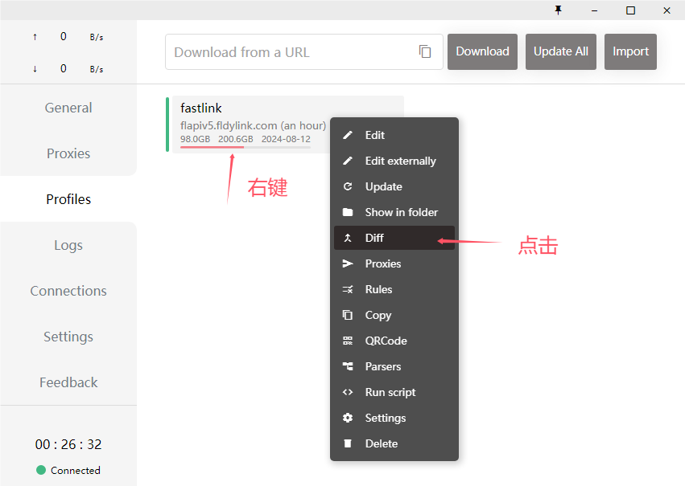
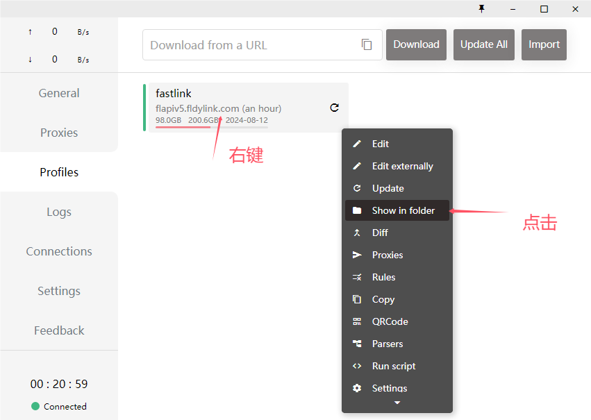
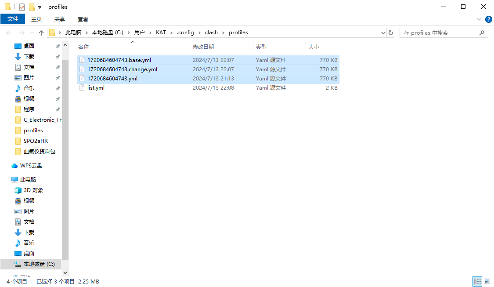
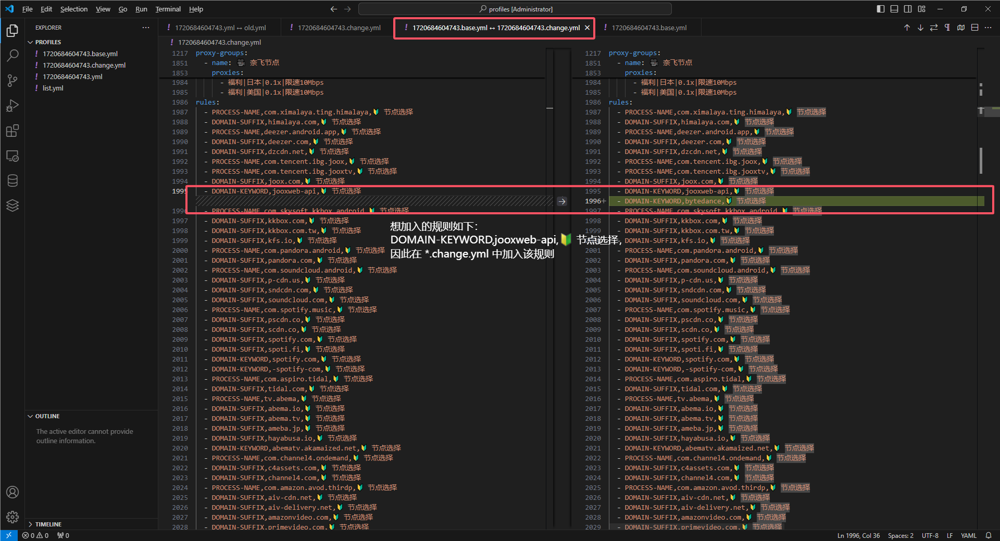
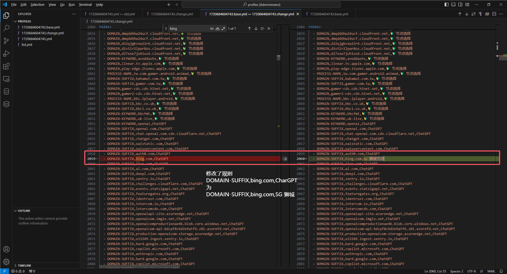
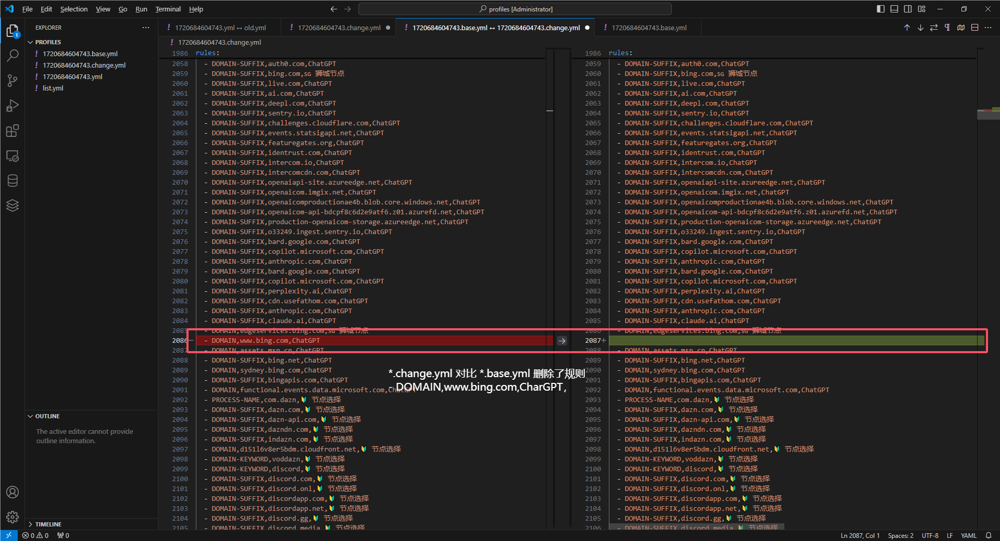

# Clash_Tutorial

> 介绍一些cfw（Clash for Windows）的使用技巧

#### Diff

> 用于更新订阅是保留自己自定义的配置

点击 **Diff** 后继续点击 **init diff files**

按图操作找到配置文件的路径

经过上述操作，你应该有如下四个文件，其中重要的是框选的三个

*.yml 是更新订阅使下载的脚本

*.base.yml 和 *.change.yml 是前一步点击 **Diff** 生成的副本

此时三个文件的内容一致

Diff功能的逻辑为：用户修改 *.change.yml中的内容，此时 *.change.yml 的内容与 *.base.yml 中的内容产生差异，Clash 将更新的 *.yml 的内容更新为 *.change.yml 中的对应内容，这种对应关系是通过 *.base.yml 和 *.change.yml 的对比建立起来的。

接下来分别用插入、修改和删除三种操作展示该逻辑

* 插入

*.change.yml 对比 *.base.yml 此处插入了一条规则``DOMAIN-KEYWORD,jooxweb-api,🔰 节点选择``，更新的 *.yml 可以根据这种差异在同样的位置加入对应的规则

* 修改

*.change.yml 对比 *.base.yml 此处修改一条规则``DOMAIN-SUFFIX,bing.com,ChatGPT``为``DOMAIN,bing.com,SG 狮城``，更新的 *.yml 将在同样的位置更新对应的规则

* 删除

*.change.yml 对比 *.base.yml 此处插入了一条规则``DOMAIN,www.bing.com,ChatGPT``，更新的 *.yml 将在同样的位置删除对应的规则

以上就是Diff的基本用法